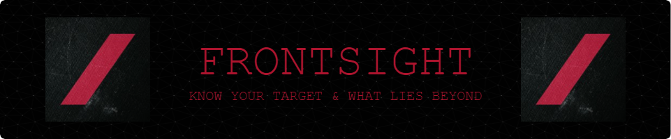

# Welcome to Frontsight

## About Us

Frontsight is a small and trusted team of Washington D.C. insiders who build OSINT tools, conduct digital investigations, and recruit cleared technologists — all in pursuit of category defining companies.

We are committed to democratizing access to information that is both accurate and captivating, while building a community of national security professionals unparalleled by anyone else with ties to Silicon Valley.

In addition to our digital investigations, we are a first-money-in venture capital firm focused on sourcing field-experienced operators who are interested in building their first business.

## Our Projects

Several projects have been forked from members personal Github pages, we are actively working on new projects!

### OSINT Scripts

[OSINT Scripts](https://github.com/Frontsightvc/Osint_Scripts) is a repository containing a collection of scripts for Open Source Intelligence (OSINT) purposes. The scripts are designed to be used in various environments, including Google Sheets, Google Apps Script, and Google Colab.

### Polling Locations

[Polling Locations](https://github.com/Frontsightvc/polling_locations) is a project designed to find polling locations using the Google Civic Information API.

### Full Stack Web App

[Full Stack Web App](https://github.com/Frontsightvc/Full_Stack_Web_app) is a capstone project that includes a scraper for CISA Alert Feeds and connections for the FullHunt API.

### Census Exploration

[Census Exploration](https://github.com/Frontsightvc/census_Exploration) is a Streamlit application that provides an interactive exploration of census data aggregated at the zip code level. The data is enriched with geocoding to provide latitude and longitude coordinates for each zip code, enabling geographical visualizations.

### What You Can Expect

We are a group of hard chargers looking to help the OSINT community. We are a team of professionals from all walks of life, but we all see the world for what it CAN be!

Check back soon for publicly posted projects and repositories.

## Disclaimer

Any tools, scripts, projects, or other resources found on the public side of this GitHub organization are provided "as is" without warranty of any kind, either expressed or implied. We are not liable for any misuse or damage caused by the use of these resources. Users are solely responsible for their actions and any consequences that may arise from using the provided resources.

## Where to Find Us

- Site: [Frontsight.vc](https://www.frontsight.vc/)
- Newsletter: [Burn After Reading] (https://burnafterreading.beehiiv.com/subscribe?ref=X4HBklQwNg)
- Discord: [SYNDICATE](https://discord.com/invite/overt-operator-967221648635871283)
- Apple Podcast: [America Builds with Will Allen and Hayley Menser](https://podcasts.apple.com/us/podcast/america-builds/id1675629568)
- Spotify: [America Builds with Will Allen and Hayley Menser](https://open.spotify.com/show/36yFqCYCI34x5LLYsP3Dz8?si=a36ef4a7bcd64a27&nd=1&dlsi=dcd95ec2ff19469f)
- LinkedIn: [Frontsight Company Page](https://www.linkedin.com/company/frontsight-vc/)
- YouTube: [Frontsight Media](https://www.youtube.com/@FrontsightMedia)

Thank you for visiting our GitHub page!
